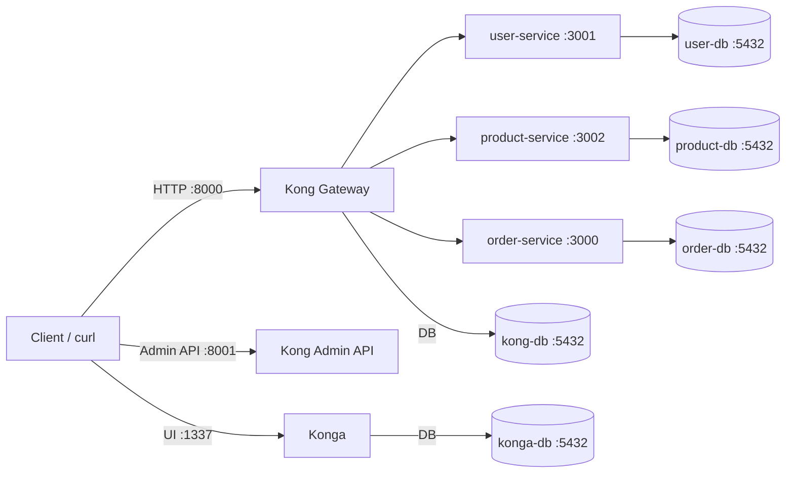
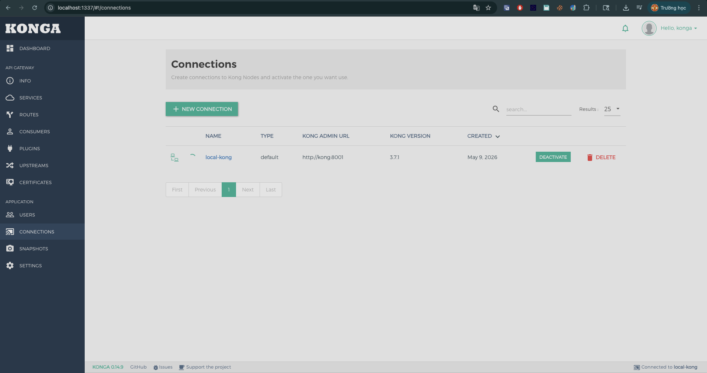

# Kong Gateway + 3 NestJS backends (Docker Compose)

Mục tiêu: chạy **Kong Gateway stack** (Kong + PostgreSQL + Konga) và **3 backend NestJS** bằng Docker Compose, rồi route traffic qua **1 entry point** (Kong proxy `:8000`).

## Architecture



## Prerequisites

- Docker Desktop (macOS) hoặc Docker Engine + Compose plugin
- Biết cơ bản `curl`

## Run

Chạy trong thư mục này:

```bash
docker compose -f docker-compose.yaml up -d
```

Đợi tất cả services `healthy`:

```bash
docker compose -f docker-compose.yaml ps
```

## Verify tối thiểu (theo yêu cầu đề)

- **Kong Admin API**: mở `http://localhost:8001` hoặc:

```bash
curl -i http://localhost:8001/status
```

- **Konga UI**: mở `http://localhost:1337`

## Register 3 Services + Routes qua Kong Admin API

Script sẽ tạo 3 services và 3 routes:

- `user-service`  -> `http://user-service:3001` route path `/users`
- `product-service` -> `http://product-service:3002` route path `/products`
- `order-service` -> `http://order-service:3000` route path `/orders`

Chạy:

```bash
chmod +x scripts/register-kong.sh scripts/verify.sh
./scripts/register-kong.sh
```

## Verify routing qua single Gateway entry point

Sau khi register:

```bash
curl -i http://localhost:8000/users
curl -i http://localhost:8000/products
curl -i http://localhost:8000/orders
```

Hoặc chạy quick-check:

```bash
./scripts/verify.sh
```

## Konga: connect tới Kong Admin

Trong Konga (`http://localhost:1337`) tạo connection:

- **Name**: `local-kong`
- **Kong Admin URL**: `http://kong:8001`


## Konga screenshot

## Stop / cleanup

```bash
docker compose -f docker-compose.yaml down -v
```


